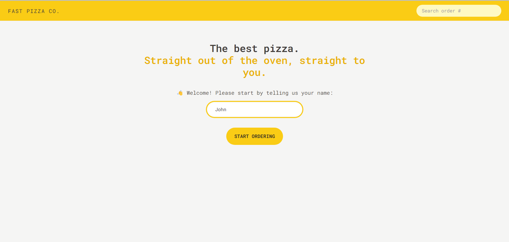
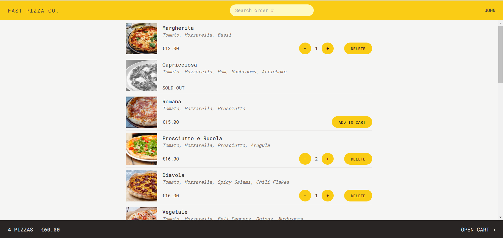
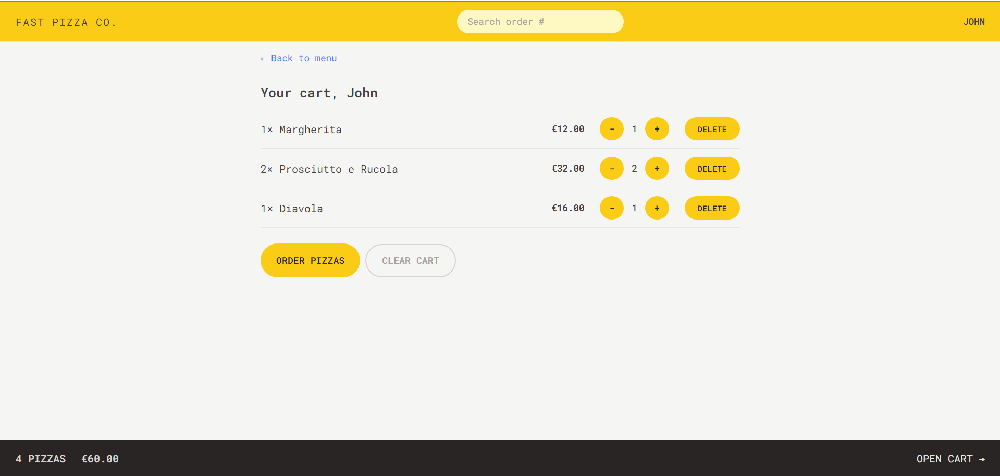
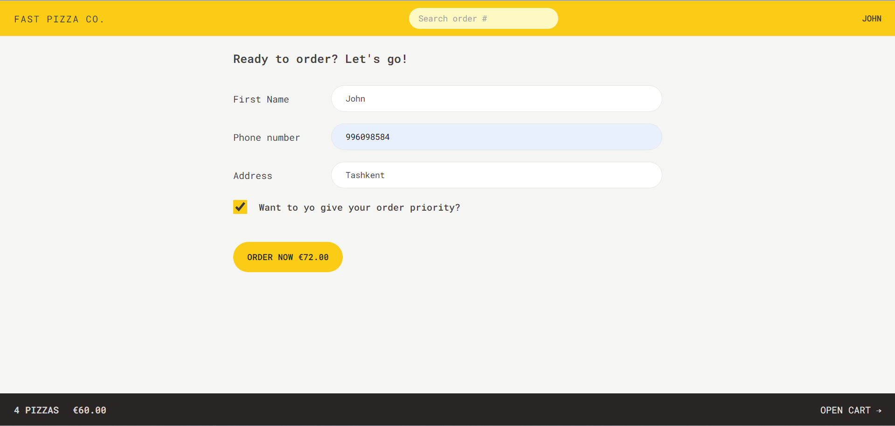
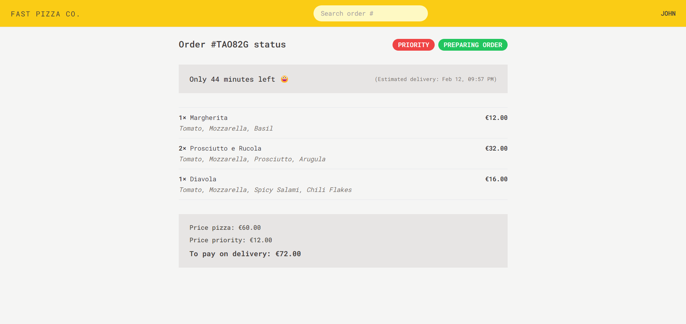

<!-- PROJECT LOGO -->
 

  <h2 align="center">FAST PIZZA CO.</h2>

  

   Straight out of the oven, straight to you!
      
    <a href="https://fast-pizza-jy.netlify.app/"><strong>View Demo »</strong></a>
   
  

<!-- ABOUT THE PROJECT -->

## About The Project

The project was built during the learning of the course "The Ultimate React Course: React, Redux & More" by <a href="#readme-top">Jonas Schmedtmann</a>. It is simple ordering pizza project

### Built With

This project was built with the following technologies:

![React.js] ![Tailwind] 

Technologies:

- React Router Dom
- Redux / Redux Tool Kit
- Using the Geolocation API

 

<!-- USAGE EXAMPLES -->

## Usage

Using the project is easy, just a few steps:

- First register by entering with your name

- Select pizzas that you want to order and they will be added to cart

- Open cart and confirm order

- Give full name, phone number and address (*choose priority if you want)

When click 'Order' button, it gets all information and show order status, time and cost. 

Wait your Order ;)

 

<!-- CONTACT -->

## Contact

Email - yuldashevjavharbek@gmail.com

 

<!-- IMAGES LINKS & -->

[Html]: https://img.shields.io/badge/HTML-logo?logo=html5
[Css]: https://img.shields.io/badge/CSS-logo?logo=css3&color=blue
[Js]: https://img.shields.io/badge/JavaScript-logo?logo=JavaScript&color=%23595959
[Next.js]: https://img.shields.io/badge/next.js-000000?style=for-the-badge&logo=nextdotjs&logoColor=white
[Next-url]: https://nextjs.org/
[React.js]: https://img.shields.io/badge/react-logo?style=for-the-badge&logo=react&color=%23333333
[Tailwind]: https://img.shields.io/badge/tailwind-logo?style=for-the-badge&logo=tailwindcss&color=%23004788
[React-url]: https://reactjs.org/
[Vue.js]: https://img.shields.io/badge/Vue.js-35495E?style=for-the-badge&logo=vuedotjs&logoColor=4FC08D
[Vue-url]: https://vuejs.org/
[Angular.io]: https://img.shields.io/badge/Angular-DD0031?style=for-the-badge&logo=angular&logoColor=white
[Angular-url]: https://angular.io/
[Svelte.dev]: https://img.shields.io/badge/Svelte-4A4A55?style=for-the-badge&logo=svelte&logoColor=FF3E00
[Svelte-url]: https://svelte.dev/
[Laravel.com]: https://img.shields.io/badge/Laravel-FF2D20?style=for-the-badge&logo=laravel&logoColor=white
[Laravel-url]: https://laravel.com
[Bootstrap.com]: https://img.shields.io/badge/Bootstrap-563D7C?style=for-the-badge&logo=bootstrap&logoColor=white
[Bootstrap-url]: https://getbootstrap.com
[JQuery.com]: https://img.shields.io/badge/jQuery-0769AD?style=for-the-badge&logo=jquery&logoColor=white
[JQuery-url]: https://jquery.com
